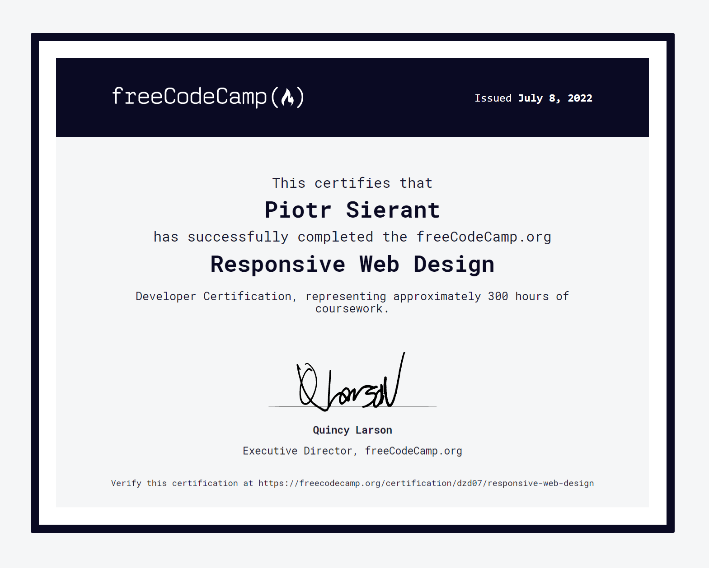

# Various projects using HTML, CSS and JavaScript.

The repository contains various practice files, my ideas and execution. Everything for the purpose of education.

* [**_[JavaScript]_** codewars.com - task](https://github.com/PiotrSierant/HTML-CSS-JS/blob/main/Codewars)

* [**_[JavaScript]_** codesignal.com - task](https://github.com/PiotrSierant/HTML-CSS-JS/tree/main/CodeSignal)
* Check out other projects above :smirk:

I practiced:
* HTML
* CSS
* RWD
* SASS
* JAVASCRIPT
* DOM JS

Certificate:
