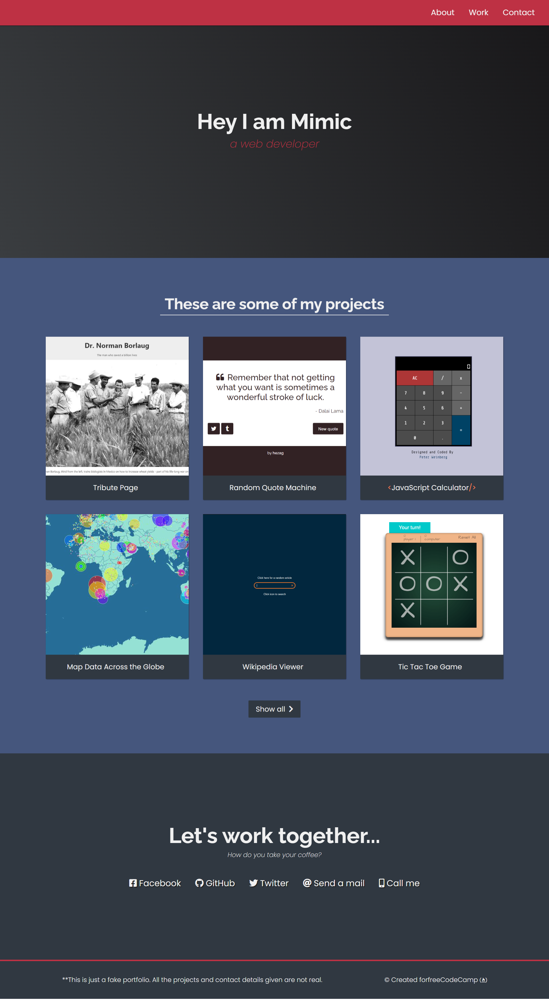
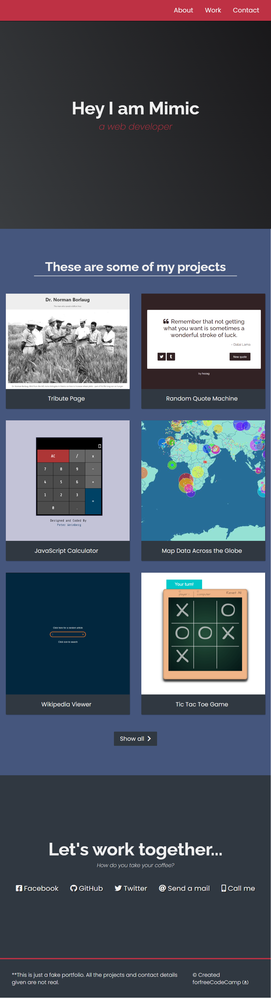
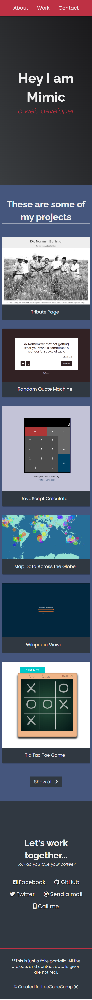

# freeCodeCamp Personal Portfolio Webpage

I practiced:
* HTML
* CSS
* RWD
* VARIABLES CSS

Layout - Desktop, Tablet, Mobile. 

[Click me and check page](https://personal-portfolio.freecodecamp.rocks/)