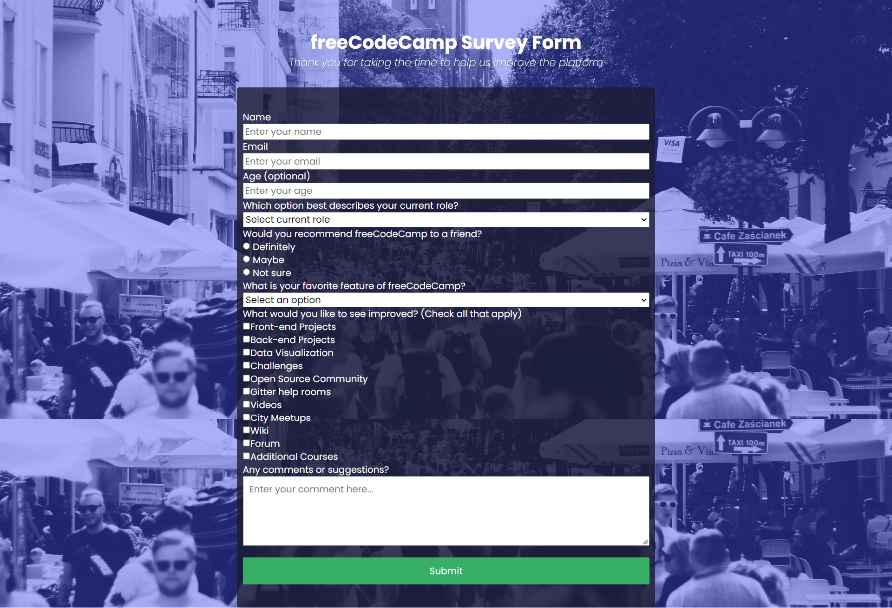
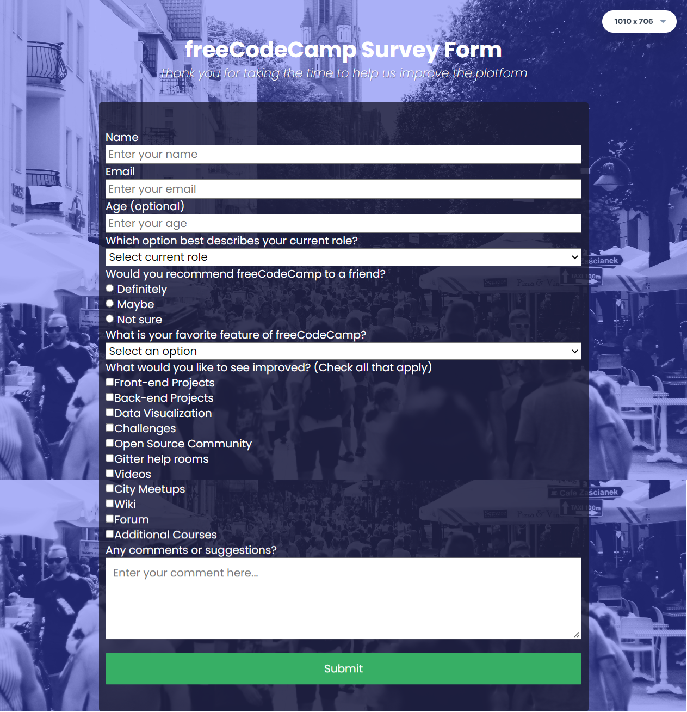
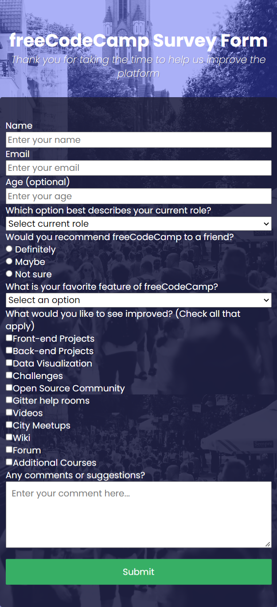

# freeCodeCamp Survey Form


I practiced:
* HTML(form)
* CSS

When taking screenshots, the plugin connects the photos, which causes the background to repeat in the photos below. 

On the page, the background remains in the same position regardless of the page length.

```
background-image: url("../images/bg.jpg");
background-size: cover;
background-position: center center;
background-repeat: no-repeat;
background-attachment: fixed;
```


Layout - Desktop, Tablet, Mobile. 



